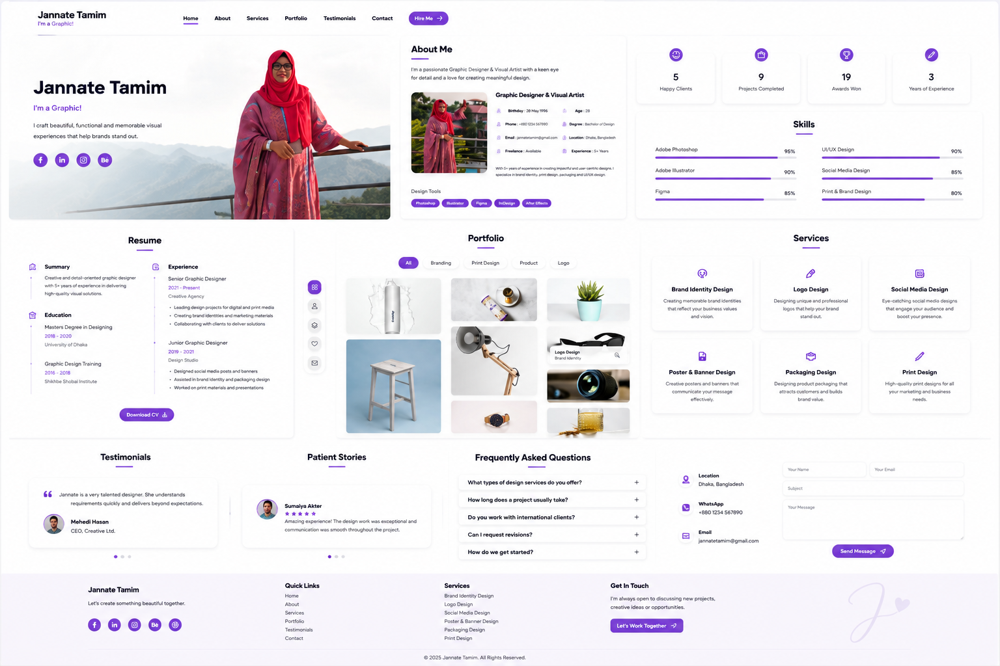

# 🎨 Jannate Tamim

### Graphic Designer & Visual Artist Portfolio

<p align="center">
  
</p>

<p align="center">
A modern, responsive personal portfolio website built with HTML5, CSS3, JavaScript, and Bootstrap 5 to showcase creative works, professional experience, design skills, and graphic design services.
</p>

<p align="center">
  <a href="https://YOUR-LIVE-DEMO.com">🌐 Live Demo</a>
  &nbsp;•&nbsp;
  <a href="https://github.com/CLIENT-USERNAME/PORTFOLIO">📂 Source Code</a>
  &nbsp;•&nbsp;
  <a href="https://absshoyeb.com">👨‍💻 Developer Portfolio</a>
</p>

---

# 📖 Overview

Jannate Tamim is a modern personal portfolio website created for a professional Graphic Designer and Visual Artist. The website provides an elegant and engaging platform to showcase creative projects, professional experience, technical skills, and design services while maintaining a clean and minimalist visual style.

Visitors can explore the designer's portfolio, learn about her background, review her resume, browse available services, read client testimonials, and get in touch through a fully responsive contact section.

This project was custom-developed for the client and is showcased as part of my professional portfolio.

---

# ✨ Features

- 🎨 Modern personal portfolio
- 👩‍🎨 Professional designer profile
- 📱 Fully responsive design
- 👤 About section
- 📊 Animated statistics
- 💡 Skills with progress bars
- 📄 Resume section
- 🖼️ Portfolio gallery
- 🔍 Portfolio filtering
- 💼 Services section
- ⭐ Client testimonials
- 📞 Contact section
- 📧 Contact form
- 🌐 Social media links
- ✨ Smooth animations
- 🎯 Clean minimalist UI

---

# 💼 Services

The portfolio showcases professional graphic design services, including:

- Brand Identity Design
- Logo Design
- Social Media Design
- Poster & Banner Design
- Packaging Design
- Print Design

---

# 🛠️ Tech Stack

### Frontend

- HTML5
- CSS3
- JavaScript (ES6)

### Frameworks & Libraries

- Bootstrap 5
- Bootstrap Icons
- AOS (Animate On Scroll)
- GLightbox
- Isotope
- Swiper.js

### Design

- CSS Variables
- Flexbox
- CSS Grid
- Media Queries
- Google Fonts

---

# ⚙️ JavaScript Functionality

The project includes several interactive frontend features:

- Responsive navigation
- Sticky header
- Mobile navigation
- Smooth scrolling
- Active navigation highlighting
- Portfolio filtering
- Portfolio lightbox
- Animated skill bars
- Scroll animations
- Testimonial slider
- Contact form validation
- Scroll-to-top button
- Preloader
- Dynamic UI interactions

---

# 📱 Responsive Design

The website is optimized for:

- 🖥️ Desktop
- 💻 Laptop
- 📱 Tablet
- 📲 Mobile
- 📳 Small mobile devices

Responsive improvements include:

- Responsive navigation
- Adaptive hero section
- Flexible portfolio gallery
- Mobile-friendly services layout
- Responsive resume section
- Mobile contact form
- Responsive typography
- Optimized spacing
- Flexible content layout

---

# 📂 Project Structure

```text
Portfolio/
│
├── assets/
│   ├── css/
│   ├── js/
│   ├── images/
│   └── vendor/
│
├── preview.png
├── index.html
└── README.md
```

---

# 🚀 Getting Started

### Clone the repository

```bash
git clone https://github.com/CLIENT-USERNAME/PORTFOLIO.git
```

### Navigate to the project

```bash
cd PORTFOLIO
```

### Run the project

Open **index.html** in your preferred browser.

For development, using **Visual Studio Code** with the **Live Server** extension is recommended.

---

# 📌 Project Status

This is a fully responsive portfolio website developed as a custom client project.

The website is optimized for performance, accessibility, and user experience while providing a professional platform for showcasing creative work and attracting potential clients.

---

# 🚀 Future Enhancements

- CMS integration
- Project management dashboard
- Blog section
- Client inquiry management
- Online booking system
- Downloadable resume
- Dark mode
- SEO optimization
- Performance improvements
- Accessibility enhancements
- Multi-language support
- Progressive Web App (PWA)

---

# 👨‍💻 Developer

This website was designed and developed by **Abu Bakar Siddik Shoyeb** as a custom portfolio project for the client.

🌐 **Portfolio**  
https://absshoyeb.com

💼 **GitHub**  
https://github.com/absshoyeb

📧 **Email**  
info.absshoyeb@gmail.com

---

# ⭐ Support

If you found this project inspiring or helpful, consider giving the repository a ⭐ on GitHub.

---

# 📄 License

This project was custom-developed for the client and is published for portfolio and demonstration purposes.

The website design, branding, portfolio content, and creative assets belong to the client.

The source code may not be reused or redistributed without permission.

© 2026 Abu Bakar Siddik Shoyeb. All rights reserved.
